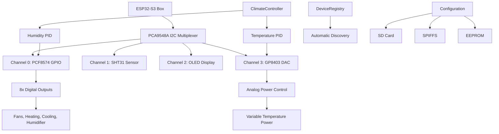

# Showcase Climate Controller

[](https://platformio.org/)
[](https://docs.espressif.com/projects/esp-idf/en/latest/esp32s3/)
[](https://www.arduino.cc/)
[](https://opensource.org/licenses/MIT)

> An object-oriented climate control system for ESP32-S3 featuring PID controllers, analog power management, and comprehensive device management through I2C multiplexing.

## Table of Contents

- [Features](#features)
- [Architecture Overview](#architecture-overview)
- [Hardware Requirements](#hardware-requirements)
- [Software Dependencies](#software-dependencies)
- [Project Structure](#project-structure)
- [Getting Started](#getting-started)
- [Usage Guide](#usage-guide)
- [Configuration](#configuration)
- [System Architecture](#system-architecture)
- [Safety Features](#safety-features)
- [Development Notes](#development-notes)
- [Testing](#testing)
- [Contributing](#contributing)
- [License](#license)

## Features

### Core Climate Control
- **Dual PID Controllers** for temperature and humidity with configurable parameters
- **Analog Power Management** via GP8403 DAC (0-100% power control)
- **Multi-mode Operation** (AUTO/HEATING/COOLING/HUMIDIFYING/DEHUMIDIFYING/OFF)
- **Hysteresis Control** for stable operation

### Hardware Integration
- **ESP32-S3 Box** with 16MB Flash and PSRAM support
- **I2C Multiplexing** via PCA9548A (8-channel support)
- **Multi-sensor Support** (SHT31/SHT40, BH1705, weight sensors)
- **GPIO Expansion** through PCF8574 (8 digital outputs)
- **User Interface** with rotary encoder and OLED display

### Professional Architecture
- **Factory Pattern** for device instantiation
- **Device Registry** with automatic discovery
- **Modular Configuration** (JSON-based with multiple sources)
- **EEPROM Persistence** with checksum validation
- **Error Recovery** and fallback mechanisms

### Connectivity & Communication
- **WiFi & MQTT** with throttling and reconnection
- **NTP Time Sync** for accurate logging
- **SD Card Support** for configuration and logging
- **Real-time Status** reporting and monitoring
- **NTP Time Sync** for accurate logging
- **SD Card Support** for configuration and logging
- **Real-time Status** reporting and monitoring

## Architecture Overview



## Hardware Requirements

### Core Components
| Component | Model | Purpose | I2C Address |
|-----------|-------|---------|-------------|
| **Microcontroller** | ESP32-S3 Box | Main controller with 16MB Flash | - |
| **I2C Multiplexer** | PCA9548A | 8-channel I2C switching | 0x70 |
| **GPIO Expander** | PCF8574 | 8 digital outputs | 0x20 |
| **Temp/Humidity** | SHT31/SHT40 | Environmental sensing | 0x44 |
| **DAC** | GP8403 | Analog power control | 0x5F |
| **Display** | SSD1306 OLED | User interface | 0x3C |
| **User Input** | Rotary Encoder | Setting adjustment | GPIO 4,5,6 |

### I2C Device Mapping
```
PCA9548A Multiplexer Channels:
├── Channel 0: PCF8574 GPIO Expander (0x20)
├── Channel 1: SHT31 Temperature/Humidity (0x44)
├── Channel 2: SSD1306 OLED Display (0x3C)
├── Channel 3: GP8403 DAC Controller (0x5F)
├── Channel 4: BH1705 Light Sensor (0x23)
├── Channel 5: Weight/Scale Sensor
├── Channel 6: [Available]
└── Channel 7: [Available]
```

### GPIO Pin Configuration
```
ESP32-S3 Pin Assignments:
├── GPIO 4: Rotary Encoder Channel A
├── GPIO 5: Rotary Encoder Channel B
├── GPIO 6: Rotary Encoder Button
├── GPIO 17: I2C SDA (System Bus)
└── GPIO 16: I2C SCL (System Bus)

PCF8574 Output Mapping:
├── Pin 0: Exterior Fan Control
├── Pin 1: Interior Fan Control
├── Pin 2: Humidification Control
├── Pin 3: Dehumidification Control
├── Pin 4: Temperature Enable
├── Pin 5: Cooling Control
├── Pin 6: Heating Control
└── Pin 7: Spare Output
```

## Software Dependencies

### Library Dependencies
```ini
lib_deps = 
    adafruit/Adafruit NeoPixel@^1.12.5    # LED status indicators
    br3ttb/PID@^1.0.0                     # PID control algorithms
    br3ttb/PID-AutoTune@^1.0.0            # PID auto-tuning capability
    knolleary/PubSubClient@^2.8           # MQTT communication
    bblanchon/ArduinoJson@7.2.1           # Latest JSON library
    arduino-libraries/NTPClient@^3.2.1    # Network time synchronization
```

### Build Configuration
```ini
[env:esp32-s3-devkitc-1]
platform = espressif32
board = esp32s3box
framework = arduino

# Memory configuration
board_build.flash_mode = qio          # Quad I/O for speed
board_build.psram_type = opi          # Octal PI PSRAM
board_build.memory_type = qio_opi     # Optimized memory access
board_build.filesystem = spiffmins    # Minimal SPIFFS for efficiency
board_upload.flash_size = 16MB       # Full flash support

# Development optimizations
build_flags = 
    -DCORE_DEBUG_LEVEL=5              # Maximum debug information
    -DARDUINO_USB_CDC_ON_BOOT=1       # USB CDC for debugging
    -DBOARD_HAS_PSRAM=1               # PSRAM feature flag
```

## Project Structure

### Device Hierarchy
```
Device (Base Class)
├── PCF8574_GPIO (GPIO Expander)
├── SHT31_Sensor (Temperature/Humidity Sensor)
├── Display (OLED Display)
├── GP8403dac (Digital-to-Analog Converter)
└── RotaryEncoder (User Input)
```

### Library Organization
```
lib/
├── Device/                     # Base device class and registry
│   ├── Device.h/.cpp          # Abstract base class for all devices
│   └── DeviceRegistry/        # Manages all devices
├── GPIO/                      # GPIO expansion devices
│   └── PCF8574_GPIO/         # PCF8574 I2C GPIO expander
├── Sensors/                   # Environmental sensors
│   └── SHT31_Sensor/         # Temperature/Humidity sensor
├── Display/                   # Display devices
│   └── Display.h/.cpp        # OLED display management
├── DAC/                      # Digital-to-analog converters
│   └── GP8403dac/           # GP8403 DAC for power control
├── Input/                    # User input devices
│   └── RotaryEncoder/        # Rotary encoder with button
├── ClimateController/        # Main control logic
│   └── ClimateController.h/.cpp # PID-based climate control
└── Config/                   # Configuration management
    └── ClimateConfig/        # EEPROM-based settings storage
```

## Hardware Configuration

### I2C Device Mapping (via PCA9548A Multiplexer)
- **Channel 0**: PCF8574 GPIO Expander (0x20)
- **Channel 1**: SHT31 Temperature/Humidity Sensor (0x44)
- **Channel 2**: SSD1306 OLED Display (0x3C)
- **Channel 3**: MCP4725 DAC Module (0x62)

### GPIO Pin Assignments
- **Pin 4**: Rotary Encoder A
- **Pin 5**: Rotary Encoder B
- **Pin 6**: Rotary Encoder Button
- **Pin 17**: I2C SDA
- **Pin 16**: I2C SCL

### PCF8574 GPIO Expander Pin Mapping
- **Pin 0**: Interior Fan Control
- **Pin 1**: Exterior Fan Control
- **Pin 2**: Humidify Control
- **Pin 3**: Dehumidify Control
- **Pin 4**: Temperature Control Enable
- **Pin 5**: Cooling Control
- **Pin 6**: Heating Control
- **Pin 7**: Spare Output

## Control System Features

### Temperature Control
- **Enable/Disable**: Digital output for temperature module power
- **Heating**: Digital output for heating element
- **Cooling**: Digital output for cooling element
- **Power Control**: Analog output (0-100%) via DAC for temperature control power

### Humidity Control
- **Humidify**: Digital output for humidification
- **Dehumidify**: Digital output for dehumidification

### PID Control
- Independent PID controllers for temperature and humidity
- Configurable PID parameters stored in EEPROM
- Safety limits and emergency shutdown capabilities

### User Interface
- Rotary encoder for setpoint adjustment
- Button press for saving settings
- OLED display showing current values and setpoints
- Real-time status updates

## Software Architecture

### Device Management
- **DeviceRegistry**: Singleton pattern for managing all devices
- **Device Base Class**: Common interface for all I2C devices
- **Automatic Initialization**: Sequential device initialization with error handling

### Configuration Management
- **ClimateConfig**: Singleton configuration manager
- **EEPROM Storage**: Persistent settings with checksum validation
- **Default Values**: Automatic fallback to safe defaults

### Control Logic
- **ClimateController**: Main control class with PID loops
- **Safety Monitoring**: Continuous monitoring of sensor limits
- **Emergency Shutdown**: Automatic shutdown on safety violations

### Features
- Real-time climate monitoring and control
- Configurable PID parameters
- Fan control for air circulation
- User-friendly interface with rotary encoder
- Persistent configuration storage
- Automatic git commits for version tracking

## Usage

1. **Setup**: The system automatically initializes all devices on startup
2. **Monitor**: View current temperature and humidity on the display
3. **Adjust**: Use the rotary encoder to change setpoints
4. **Save**: Press the encoder button to save settings to EEPROM
5. **Control**: The system automatically maintains target conditions using PID control

## Dependencies

- PID Library for control algorithms
- Adafruit libraries for display support
- Standard Arduino libraries for I2C and EEPROM

## Safety Features

- Temperature and humidity limit monitoring
- Automatic emergency shutdown on sensor failures
- Configurable safety limits
- Checksum validation for stored settings

This project is an ESP32S3-based climate controller designed for demonstration and educational purposes. It features I2C device scanning, GPIO expansion, and basic climate control logic.

## Features

- I2C bus scanning (direct and via PCA9548A multiplexer)
- PCF8574 GPIO expander control
- Basic climate actuator control (fans, humidify, dehumidify, heat, cool)
- Designed for ESP32S3 with PlatformIO and Arduino framework
- Automatic Git commit and push on file save (with VSCode "Run on Save" extension)

## Hardware

- ESP32S3 DevKitC-1
- PCA9548A I2C multiplexer
- PCF8574 I2C GPIO expander
- Various actuators (fans, humidifier, dehumidifier, heater, cooler)

## Getting Started

### Prerequisites

- [PlatformIO](https://platformio.org/) extension for VSCode
- [VSCode](https://code.visualstudio.com/)
- "Run on Save" VSCode extension (optional, for auto Git commit/push)
- Git installed and configured

### Setup

1. Clone this repository:
    ```sh
    git clone <your-repo-url>
    ```
2. Open the project folder in VSCode.
3. Install PlatformIO and required libraries (see `platformio.ini`).
4. Connect your ESP32S3 board.
5. Build and upload the firmware using PlatformIO.

### Auto Git Commit/Push (Optional)

To automatically commit and push changes on every file save:
- Install the "Run on Save" extension in VSCode.
- Ensure `.vscode/settings.json` contains:
    ```jsonc
    "emeraldwalk.runonsave": {
        "commands": [
            {
                "match": ".*",
                "cmd": "git add . && git commit -m \"Auto-commit on save\" && git push"
            }
        ]
    }
    ```

## Usage

- On boot, the ESP32S3 scans for I2C devices and initializes the PCF8574 GPIO expander.
- Actuators can be controlled via the PCF8574 outputs.
- Serial output provides I2C scan results and status messages.

## License

This project is for educational use. See LICENSE file for details (if present).

## Author

Ron Groenen
