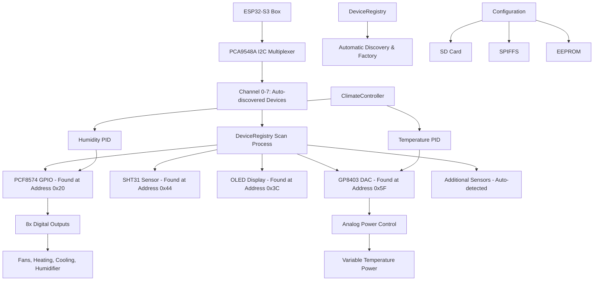

# Showcase Climate Controller

[](https://platformio.org/)
[](https://docs.espressif.com/projects/esp-idf/en/latest/esp32s3/)
[](https://www.arduino.cc/)
[](https://opensource.org/licenses/MIT)

> An object-oriented climate control system for ESP32-S3 featuring PID controllers, analog power management, and comprehensive device management through I2C multiplexing.

## Table of Contents

- [Features](#features)
- [Architecture Overview](#architecture-overview)
- [Hardware Requirements](#hardware-requirements)
- [Software Dependencies](#software-dependencies)
- [Project Structure](#project-structure)
- [Getting Started](#getting-started)
- [Usage Guide](#usage-guide)
- [Configuration](#configuration)
- [System Architecture](#system-architecture)
- [Safety Features](#safety-features)
- [Development Notes](#development-notes)
- [Testing](#testing)
- [Contributing](#contributing)
- [License](#license)

## Features

### Core Climate Control
- **Dual PID Controllers** for temperature and humidity with configurable parameters
- **Analog Power Management** via GP8403 DAC (0-100% power control)
- **Multi-mode Operation** (AUTO/HEATING/COOLING/HUMIDIFYING/DEHUMIDIFYING/OFF)
- **Hysteresis Control** for stable operation

### Hardware Integration
- **ESP32-S3 Box** with 16MB Flash and PSRAM support
- **I2C Multiplexing** via PCA9548A (8-channel support)
- **Multi-sensor Support** (SHT31/SHT40, BH1705, weight sensors)
- **GPIO Expansion** through PCF8574 (8 digital outputs)
- **User Interface** with rotary encoder and OLED display

### Professional Architecture
- **Factory Pattern** for device instantiation
- **Device Registry** with automatic discovery
- **Modular Configuration** (JSON-based with multiple sources)
- **EEPROM Persistence** with checksum validation
- **Error Recovery** and fallback mechanisms

### Connectivity & Communication
- **WiFi & MQTT** with throttling and reconnection
- **NTP Time Sync** for accurate logging
- **SD Card Support** for configuration and logging
- **Real-time Status** reporting and monitoring
- **NTP Time Sync** for accurate logging
- **SD Card Support** for configuration and logging
- **Real-time Status** reporting and monitoring

## Architecture Overview



## Hardware Requirements

### Core Components
| Component | Model | Purpose | I2C Address |
|-----------|-------|---------|-------------|
| **Microcontroller** | ESP32-S3 Box | Main controller with 16MB Flash | - |
| **I2C Multiplexer** | PCA9548A | 8-channel I2C switching | 0x70 |
| **GPIO Expander** | PCF8574 | 8 digital outputs | 0x20 |
| **Temp/Humidity** | SHT31/SHT40 | Environmental sensing | 0x44 |
| **DAC** | GP8403 | Analog power control | 0x5F |
| **Display** | SSD1306 OLED | User interface | 0x3C |
| **User Input** | Rotary Encoder | Setting adjustment | GPIO 4,5,6 |

### I2C Device Mapping (Automatically Discovered)

The system automatically scans all PCA9548A multiplexer channels (0-7) during startup to detect connected devices. Channel assignments are determined by the physical connections, not hardcoded in software.

**Device Detection Process:**
1. System scans each multiplexer channel sequentially
2. Identifies devices by their I2C addresses
3. Creates device instances through the DeviceRegistry factory pattern
4. Devices can be connected to any available channel

**Example Configuration (devices detected by I2C address):**
```
Supported Device Types:
├── PCF8574 GPIO Expander (I2C: 0x20) - Any available channel
├── SHT31 Temperature/Humidity (I2C: 0x44) - Any available channel
├── SSD1306 OLED Display (I2C: 0x3C) - Any available channel
├── GP8403 DAC Controller (I2C: 0x5F) - Any available channel
├── BH1705 Light Sensor (I2C: 0x23) - Any available channel
├── Weight/Scale Sensor (custom I2C) - Any available channel
├── [Channel X]: Automatically assigned based on detection
└── [Channel Y]: Automatically assigned based on detection
```

**Runtime Discovery Output Example:**
```
[INFO] Scanning PCA9548A Channel 0... Found: PCF8574 (0x20)
[INFO] Scanning PCA9548A Channel 1... Found: SHT31 (0x44)
[INFO] Scanning PCA9548A Channel 2... Found: SSD1306 (0x3C)
[INFO] Scanning PCA9548A Channel 3... Found: GP8403 (0x5F)
[INFO] Device Registry: 4 devices initialized
```

### GPIO Pin Configuration
```
ESP32-S3 Pin Assignments:
├── GPIO 4: Rotary Encoder Channel A
├── GPIO 5: Rotary Encoder Channel B
├── GPIO 6: Rotary Encoder Button
├── GPIO 17: I2C SDA (System Bus)
└── GPIO 16: I2C SCL (System Bus)

PCF8574 Output Mapping:
├── Pin 0: Exterior Fan Control
├── Pin 1: Interior Fan Control
├── Pin 2: Humidification Control
├── Pin 3: Dehumidification Control
├── Pin 4: Temperature Enable
├── Pin 5: Cooling Control
├── Pin 6: Heating Control
└── Pin 7: Spare Output
```

## Software Dependencies

### PlatformIO Configuration
```ini
[env:esp32-s3-devkitc-1]
platform = espressif32
board = esp32s3box
framework = arduino

# Memory configuration
board_build.flash_mode = qio          # Quad I/O for speed
board_build.psram_type = opi          # Octal PI PSRAM
board_build.memory_type = qio_opi     # Optimized memory access
board_build.filesystem = spiffmins    # Minimal SPIFFS for efficiency
board_upload.flash_size = 16MB       # Full flash support

# Development optimizations
build_flags = 
    -DCORE_DEBUG_LEVEL=5              # Maximum debug information
    -DARDUINO_USB_CDC_ON_BOOT=1       # USB CDC for debugging
    -DBOARD_HAS_PSRAM=1               # PSRAM feature flag

lib_deps = 
    adafruit/Adafruit NeoPixel@^1.12.5    # LED status indicators
    br3ttb/PID@^1.0.0                     # PID control algorithms
    br3ttb/PID-AutoTune@^1.0.0            # PID auto-tuning capability
    knolleary/PubSubClient@^2.8           # MQTT communication
    bblanchon/ArduinoJson@7.2.1           # Latest JSON library
    arduino-libraries/NTPClient@^3.2.1    # Network time synchronization
```

## Project Structure

### Source Code Organization

**Note: CPP files moved from lib/ to src/ due to PlatformIO synchronization issues**

PlatformIO has synchronization problems when multiple CPP files are located in library directories under `lib/`. To resolve compilation and linking issues, all implementation files have been moved to the `src/` directory while header files remain in their respective library folders for proper organization.

```
src/                               # Main source files (moved from lib/)
├── main.cpp                      # Application entry point
├── ClimateController.cpp         # Main climate control logic
├── Device.cpp                    # Base device implementation
├── DeviceRegistry.cpp            # Device factory and registry
├── Display.cpp                   # OLED display implementation
├── GP8403dac.cpp                 # DAC controller implementation
├── PCF8574_GPIO.cpp              # GPIO expander implementation
├── RotaryEncoder.cpp             # Rotary encoder implementation
├── SHT31_Sensor.cpp              # Temperature/humidity sensor
├── ClimateConfig.cpp             # Configuration management
└── [other implementation files]

lib/                              # Library headers and configurations
├── Device/                       # Base device class and registry
│   ├── Device.h                 # Abstract base class for all devices
│   └── DeviceRegistry/          # Manages all devices
├── GPIO/                        # GPIO expansion devices
│   └── PCF8574_GPIO/           # PCF8574 I2C GPIO expander
├── Sensors/                     # Environmental sensors
│   ├── SHTsensor/              # Temperature/humidity
│   ├── BH1705sensor/           # Light measurement
│   └── SCALESsensor/           # Weight measurement
├── Display/                     # Display devices
│   └── Display.h               # OLED display management
├── DAC/                        # Digital-to-analog converters
│   └── GP8403dac/             # GP8403 DAC for power control
├── Input/                      # User input devices
│   └── RotaryEncoder/          # Rotary encoder with button
├── ClimateController/          # Main control logic
│   └── ClimateController.h     # PID-based climate control
└── Config/                     # Configuration management
    └── ClimateConfig/          # EEPROM-based settings storage
```

### Device Hierarchy
```
Device (Base Class)
├── PCF8574_GPIO (GPIO Expander)
├── SHT31_Sensor (Temperature/Humidity Sensor)
├── Display (OLED Display)
├── GP8403dac (Digital-to-Analog Converter)
└── RotaryEncoder (User Input)
```
## Getting Started

### Prerequisites
- [Visual Studio Code](https://code.visualstudio.com/)
- [PlatformIO IDE Extension](https://platformio.org/platformio-ide)
- [Git](https://git-scm.com/) (for version control)
- ESP32-S3 development board
- Required hardware components (see Hardware Requirements)

### Installation

1. **Clone the Repository**
   ```bash
   git clone https://github.com/your-username/showcase-climate-controller.git
   cd showcase-climate-controller
   ```

2. **Open in VS Code**
   ```bash
   code .
   ```

3. **Install Dependencies**
   - PlatformIO will automatically install dependencies from `platformio.ini`
   - Or manually via PlatformIO CLI:
   ```bash
   pio lib install
   ```

4. **Configure Hardware**
   - Connect I2C devices to any available PCA9548A multiplexer channels
   - No specific channel assignment required - system auto-discovers devices
   - Verify I2C addresses match supported device types (see Hardware Requirements)
   - Check power supply requirements (3.3V/5V)

5. **Build and Upload**
   ```bash
   pio run --target upload
   ```

6. **Monitor Serial Output**
   ```bash
   pio device monitor --baud 115200
   ```

### First Run Setup

1. **Device Discovery**
   - System automatically scans I2C bus
   - Initializes all detected devices
   - Creates default configuration if none exists

2. **Configuration Files**
   ```
   SD Card (preferred):
   ├── config.json           # Main system configuration
   ├── ClimateConfig.json    # Climate-specific settings
   └── devices.json          # Device definitions
   
   SPIFFS (fallback):
   └── data/
       ├── config.json
       └── ClimateConfig.json
   ```

3. **Initial Calibration**
   - Set temperature and humidity setpoints
   - Adjust PID parameters if needed
   - Test emergency shutdown functionality

## Usage Guide

### Basic Operation

1. **System Startup**
   ```
   [INFO] Starting Showcase Climate Controller...
   [INFO] Scanning I2C bus...
   [INFO] Found 5 devices
   [INFO] Initializing Climate Controller...
   [INFO] PID controllers ready
   [INFO] System operational
   ```

2. **Setting Adjustment**
   - **Rotate encoder**: Change temperature/humidity setpoints (0.1°C / 1% increments)
   - **Press button**: Save settings to EEPROM
   - **Hold button**: Enter configuration mode

3. **Mode Selection**
   - **AUTO**: Automatic heating/cooling based on setpoint
   - **HEATING**: Heating only mode
   - **COOLING**: Cooling only mode
   - **OFF**: Climate control disabled

### Advanced Features

#### PID Tuning
```cpp
// Access via serial commands or configuration file
climateController->setTemperaturePID(2.0, 0.5, 0.1);  // Kp, Ki, Kd
climateController->setHumidityPID(1.0, 0.2, 0.05);
```

#### Power Control
```cpp
// DAC provides 0-5V output for variable power
// 0V = 0% power, 5V = 100% power
setHeatingPower(75.0);  // 75% heating power = 3.75V output
```

## Configuration

### Configuration Hierarchy
1. **SD Card** (`/config.json`) - Highest priority
2. **SPIFFS** (`/data/config.json`) - Fallback
3. **EEPROM** (ClimateConfig) - Persistent settings
4. **Compiled Defaults** - Last resort

### Main Configuration (`config.json`)
```json
{
  "system": {
    "device_name": "ClimateController_01",
    "update_interval_ms": 5000,
    "debug_level": 3
  },
  "wifi": {
    "ssid": "YourNetwork",
    "password": "YourPassword",
    "timeout_ms": 10000
  },
  "mqtt": {
    "server": "mqtt.broker.com",
    "port": 1883,
    "topic_prefix": "climate/controller"
  },
  "climate": {
    "enabled": true,
    "temperature_setpoint": 22.0,
    "humidity_setpoint": 50.0,
    "update_interval_ms": 3000
  }
}
```

### Climate Configuration (`ClimateConfig.json`)
```json
{
  "setpoints": {
    "temperature": 22.0,
    "humidity": 50.0
  },
  "modes": {
    "climate_mode": "AUTO",
    "humidity_mode": "AUTO"
  },
  "pid_parameters": {
    "temperature": {
      "kp": 2.0,
      "ki": 0.5,
      "kd": 0.1
    },
    "humidity": {
      "kp": 1.0,
      "ki": 0.2,
      "kd": 0.05
    }
  }
}
```

## System Architecture

### Device Management
- **DeviceRegistry**: Singleton pattern for managing all devices
- **Device Base Class**: Common interface for all I2C devices
- **Automatic Initialization**: Sequential device initialization with error handling

### Configuration Management
- **ClimateConfig**: Singleton configuration manager
- **EEPROM Storage**: Persistent settings with checksum validation
- **Default Values**: Automatic fallback to safe defaults

### Control Logic
- **ClimateController**: Main control class with PID loops
- **Safety Monitoring**: Continuous monitoring of sensor limits
- **Emergency Shutdown**: Automatic shutdown on safety violations

## Safety Features

- Temperature and humidity limit monitoring
- Automatic emergency shutdown on sensor failures
- Checksum validation for stored settings
- Hysteresis control for stable operation
- Error recovery and fallback mechanisms

## Development Notes

### PlatformIO File Organization
Due to synchronization issues with PlatformIO when using multiple CPP files in library directories, all implementation files have been moved to the `src/` directory. This resolves compilation and linking problems while maintaining logical organization through header files in the `lib/` directory structure.

### Auto Git Integration
To automatically commit and push changes on every file save:
- Install the "Run on Save" extension in VSCode
- Ensure `.vscode/settings.json` contains:
  ```json
  {
    "emeraldwalk.runonsave": {
      "commands": [
        {
          "match": ".*",
          "cmd": "git add . && git commit -m \"Auto-commit on save\" && git push"
        }
      ]
    }
  }
  ```

## Testing

### Unit Testing
- Individual device functionality tests
- PID controller response testing
- Configuration persistence validation

### Integration Testing
- Full system startup sequence
- Device communication verification
- Safety system activation tests

### Performance Testing
- Response time measurements
- Memory usage optimization
- Power consumption analysis

## Contributing

1. Fork the repository
2. Create a feature branch (`git checkout -b feature/amazing-feature`)
3. Commit your changes (`git commit -m 'Add amazing feature'`)
4. Push to the branch (`git push origin feature/amazing-feature`)
5. Open a Pull Request

## License

This project is licensed under the MIT License - see the [LICENSE](LICENSE) file for details.

## Author

Ron Groenen - Educational project for Fontys University of Applied Sciences
