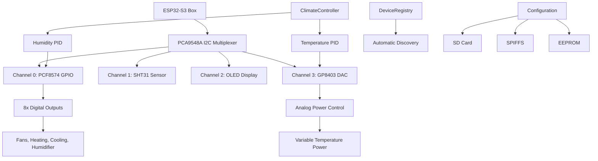

# Showcase Climate Controller

[](https://platformio.org/)
[](https://docs.espressif.com/projects/esp-idf/en/latest/esp32s3/)
[](https://www.arduino.cc/)
[](https://opensource.org/licenses/MIT)

> An object-oriented climate control system for ESP32-S3 featuring PID controllers, analog power management, and comprehensive device management through I2C multiplexing.

## Table of Contents

- [Features](#features)
- [Architecture Overview](#architecture-overview)
- [Hardware Requirements](#hardware-requirements)
- [Software Dependencies](#software-dependencies)
- [Project Structure](#project-structure)
- [Getting Started](#getting-started)
- [Usage Guide](#usage-guide)
- [Configuration](#configuration)
- [System Architecture](#system-architecture)
- [Safety Features](#safety-features)
- [Development Notes](#development-notes)
- [Testing](#testing)
- [Contributing](#contributing)
- [License](#license)

## Features

### Core Climate Control
- **Dual PID Controllers** for temperature and humidity with configurable parameters
- **Analog Power Management** via GP8403 DAC (0-100% power control)
- **Multi-mode Operation** (AUTO/HEATING/COOLING/HUMIDIFYING/DEHUMIDIFYING/OFF)
- **Hysteresis Control** for stable operation

### Hardware Integration
- **ESP32-S3 Box** with 16MB Flash and PSRAM support
- **I2C Multiplexing** via PCA9548A (8-channel support)
- **Multi-sensor Support** (SHT31/SHT40, BH1705, weight sensors)
- **GPIO Expansion** through PCF8574 (8 digital outputs)
- **User Interface** with rotary encoder and OLED display

### Professional Architecture
- **Factory Pattern** for device instantiation
- **Device Registry** with automatic discovery
- **Modular Configuration** (JSON-based with multiple sources)
- **EEPROM Persistence** with checksum validation
- **Error Recovery** and fallback mechanisms

### Connectivity & Communication
- **WiFi & MQTT** with throttling and reconnection
- **NTP Time Sync** for accurate logging
- **SD Card Support** for configuration and logging
- **Real-time Status** reporting and monitoring
- **NTP Time Sync** for accurate logging
- **SD Card Support** for configuration and logging
- **Real-time Status** reporting and monitoring

## Architecture Overview



## Hardware Requirements

### Core Components
| Component | Model | Purpose | I2C Address |
|-----------|-------|---------|-------------|
| **Microcontroller** | ESP32-S3 Box | Main controller with 16MB Flash | - |
| **I2C Multiplexer** | PCA9548A | 8-channel I2C switching | 0x70 |
| **GPIO Expander** | PCF8574 | 8 digital outputs | 0x20 |
| **Temp/Humidity** | SHT31/SHT40 | Environmental sensing | 0x44 |
| **DAC** | GP8403 | Analog power control | 0x5F |
| **Display** | SSD1306 OLED | User interface | 0x3C |
| **User Input** | Rotary Encoder | Setting adjustment | GPIO 4,5,6 |

### I2C Device Mapping
```
PCA9548A Multiplexer Channels:
├── Channel 0: PCF8574 GPIO Expander (0x20)
├── Channel 1: SHT31 Temperature/Humidity (0x44)
├── Channel 2: SSD1306 OLED Display (0x3C)
├── Channel 3: GP8403 DAC Controller (0x5F)
├── Channel 4: BH1705 Light Sensor (0x23)
├── Channel 5: Weight/Scale Sensor
├── Channel 6: [Available]
└── Channel 7: [Available]
```

### GPIO Pin Configuration
```
ESP32-S3 Pin Assignments:
├── GPIO 4: Rotary Encoder Channel A
├── GPIO 5: Rotary Encoder Channel B
├── GPIO 6: Rotary Encoder Button
├── GPIO 17: I2C SDA (System Bus)
└── GPIO 16: I2C SCL (System Bus)

PCF8574 Output Mapping:
├── Pin 0: Exterior Fan Control
├── Pin 1: Interior Fan Control
├── Pin 2: Humidification Control
├── Pin 3: Dehumidification Control
├── Pin 4: Temperature Enable
├── Pin 5: Cooling Control
├── Pin 6: Heating Control
└── Pin 7: Spare Output
```

## Software Dependencies

### PlatformIO Configuration
```ini
[env:esp32-s3-devkitc-1]
platform = espressif32
board = esp32s3box
framework = arduino

# Memory configuration
board_build.flash_mode = qio          # Quad I/O for speed
board_build.psram_type = opi          # Octal PI PSRAM
board_build.memory_type = qio_opi     # Optimized memory access
board_build.filesystem = spiffmins    # Minimal SPIFFS for efficiency
board_upload.flash_size = 16MB       # Full flash support

# Development optimizations
build_flags = 
    -DCORE_DEBUG_LEVEL=5              # Maximum debug information
    -DARDUINO_USB_CDC_ON_BOOT=1       # USB CDC for debugging
    -DBOARD_HAS_PSRAM=1               # PSRAM feature flag

lib_deps = 
    adafruit/Adafruit NeoPixel@^1.12.5    # LED status indicators
    br3ttb/PID@^1.0.0                     # PID control algorithms
    br3ttb/PID-AutoTune@^1.0.0            # PID auto-tuning capability
    knolleary/PubSubClient@^2.8           # MQTT communication
    bblanchon/ArduinoJson@7.2.1           # Latest JSON library
    arduino-libraries/NTPClient@^3.2.1    # Network time synchronization
```

## Project Structure

### Source Code Organization

**Note: CPP files moved from lib/ to src/ due to PlatformIO synchronization issues**

PlatformIO has synchronization problems when multiple CPP files are located in library directories under `lib/`. To resolve compilation and linking issues, all implementation files have been moved to the `src/` directory while header files remain in their respective library folders for proper organization.

```
src/                               # Main source files (moved from lib/)
├── main.cpp                      # Application entry point
├── ClimateController.cpp         # Main climate control logic
├── Device.cpp                    # Base device implementation
├── DeviceRegistry.cpp            # Device factory and registry
├── Display.cpp                   # OLED display implementation
├── GP8403dac.cpp                 # DAC controller implementation
├── PCF8574_GPIO.cpp              # GPIO expander implementation
├── RotaryEncoder.cpp             # Rotary encoder implementation
├── SHT31_Sensor.cpp              # Temperature/humidity sensor
├── ClimateConfig.cpp             # Configuration management
└── [other implementation files]

lib/                              # Library headers and configurations
├── Device/                       # Base device class and registry
│   ├── Device.h                 # Abstract base class for all devices
│   └── DeviceRegistry/          # Manages all devices
├── GPIO/                        # GPIO expansion devices
│   └── PCF8574_GPIO/           # PCF8574 I2C GPIO expander
├── Sensors/                     # Environmental sensors
│   ├── SHTsensor/              # Temperature/humidity
│   ├── BH1705sensor/           # Light measurement
│   └── SCALESsensor/           # Weight measurement
├── Display/                     # Display devices
│   └── Display.h               # OLED display management
├── DAC/                        # Digital-to-analog converters
│   └── GP8403dac/             # GP8403 DAC for power control
├── Input/                      # User input devices
│   └── RotaryEncoder/          # Rotary encoder with button
├── ClimateController/          # Main control logic
│   └── ClimateController.h     # PID-based climate control
└── Config/                     # Configuration management
    └── ClimateConfig/          # EEPROM-based settings storage
```

### Device Hierarchy
```
Device (Base Class)
├── PCF8574_GPIO (GPIO Expander)
├── SHT31_Sensor (Temperature/Humidity Sensor)
├── Display (OLED Display)
├── GP8403dac (Digital-to-Analog Converter)
└── RotaryEncoder (User Input)
```
## Getting Started

### Prerequisites
- [Visual Studio Code](https://code.visualstudio.com/)
- [PlatformIO IDE Extension](https://platformio.org/platformio-ide)
- [Git](https://git-scm.com/) (for version control)
- ESP32-S3 development board
- Required hardware components (see Hardware Requirements)

### Installation

1. **Clone the Repository**
   ```bash
   git clone https://github.com/your-username/showcase-climate-controller.git
   cd showcase-climate-controller
   ```

2. **Open in VS Code**
   ```bash
   code .
   ```

3. **Install Dependencies**
   - PlatformIO will automatically install dependencies from `platformio.ini`
   - Or manually via PlatformIO CLI:
   ```bash
   pio lib install
   ```

4. **Configure Hardware**
   - Connect I2C devices according to the hardware mapping
   - Verify I2C addresses match configuration
   - Check power supply requirements (3.3V/5V)

5. **Build and Upload**
   ```bash
   pio run --target upload
   ```

6. **Monitor Serial Output**
   ```bash
   pio device monitor --baud 115200
   ```

### First Run Setup

1. **Device Discovery**
   - System automatically scans I2C bus
   - Initializes all detected devices
   - Creates default configuration if none exists

2. **Configuration Files**
   ```
   SD Card (preferred):
   ├── config.json           # Main system configuration
   ├── ClimateConfig.json    # Climate-specific settings
   └── devices.json          # Device definitions
   
   SPIFFS (fallback):
   └── data/
       ├── config.json
       └── ClimateConfig.json
   ```

3. **Initial Calibration**
   - Set temperature and humidity setpoints
   - Adjust PID parameters if needed
   - Test emergency shutdown functionality
