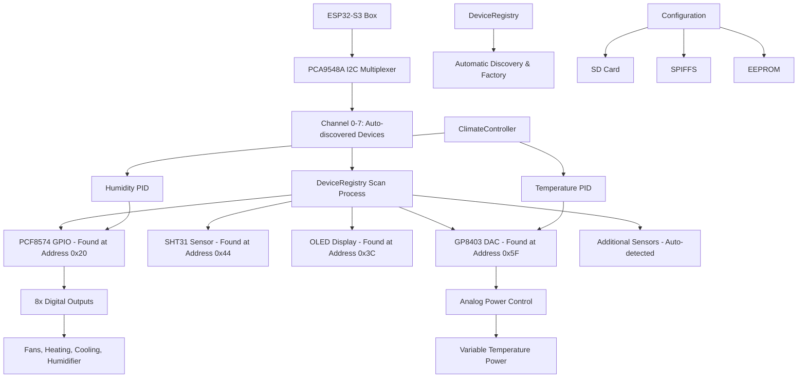

# Showcase Climate Controller

[](https://platformio.org/)
[](https://docs.espressif.com/projects/esp-idf/en/latest/esp32s3/)
[](https://www.arduino.cc/)
[](https://opensource.org/licenses/MIT)

> An object-oriented climate control system for ESP32-S3 featuring PID controllers, analog power management, and comprehensive device management through I2C multiplexing.

## Table of Contents

- [Features](#features)
- [Architecture Overview](#architecture-overview)
- [Hardware Requirements](#hardware-requirements)
- [Software Dependencies](#software-dependencies)
- [Project Structure](#project-structure)
- [Getting Started](#getting-started)
- [Usage Guide](#usage-guide)
- [Configuration](#configuration)
- [System Architecture](#system-architecture)
- [Safety Features](#safety-features)
- [Development Notes](#development-notes)
- [Testing](#testing)
- [Contributing](#contributing)
- [License](#license)

## Features

### Core Climate Control
- **Dual PID Controllers** for temperature and humidity with configurable parameters
- **Analog Power Management** via GP8403 DAC (0-100% power control)
- **Multi-mode Operation** (AUTO/HEATING/COOLING/HUMIDIFYING/DEHUMIDIFYING/OFF)
- **Hysteresis Control** for stable operation

### Hardware Integration
- **ESP32-S3 Box** with 16MB Flash and PSRAM support
- **I2C Multiplexing** via PCA9548A (8-channel support)
- **Multi-sensor Support** (SHT31/SHT40, BH1705, weight sensors)
- **GPIO Expansion** through PCF8574 (8 digital outputs)
- **User Interface** with rotary encoder and OLED display

### Professional Architecture
- **Factory Pattern** for device instantiation
- **Device Registry** with automatic discovery
- **Modular Configuration** (JSON-based with multiple sources)
- **EEPROM Persistence** with checksum validation
- **Error Recovery** and fallback mechanisms

### Connectivity & Communication
- **WiFi & MQTT** with throttling and reconnection
- **NTP Time Sync** for accurate logging
- **SD Card Support** for configuration and logging
- **Real-time Status** reporting and monitoring
- **NTP Time Sync** for accurate logging
- **SD Card Support** for configuration and logging
- **Real-time Status** reporting and monitoring

## Architecture Overview



## Hardware Requirements

### Core Components
| Component | Model | Purpose | I2C Address |
|-----------|-------|---------|-------------|
| **Microcontroller** | ESP32-S3 Box | Main controller with 16MB Flash | - |
| **I2C Multiplexer** | PCA9548A | 8-channel I2C switching | 0x70 |
| **GPIO Expander** | PCF8574 | 8 digital outputs | 0x20 |
| **Temp/Humidity** | SHT31/SHT40 | Environmental sensing | 0x44 |
| **DAC** | GP8403 | Analog power control | 0x5F |
| **Display** | SSD1306 OLED | User interface | 0x3C |
| **User Input** | Rotary Encoder | Setting adjustment | GPIO 4,5,6 |

### I2C Device Mapping (Automatically Discovered)

The system automatically scans all PCA9548A multiplexer channels (0-7) during startup to detect connected devices. Channel assignments are determined by the physical connections, not hardcoded in software.

**Device Detection Process:**
1. System scans each multiplexer channel sequentially
2. Identifies devices by their I2C addresses
3. Creates device instances through the DeviceRegistry factory pattern
4. Devices can be connected to any available channel

**Example Configuration (devices detected by I2C address):**
```
Supported Device Types:
├── PCF8574 GPIO Expander (I2C: 0x20) - Any available channel
├── SHT31 Temperature/Humidity (I2C: 0x44) - Any available channel
├── SSD1306 OLED Display (I2C: 0x3C) - Any available channel
├── GP8403 DAC Controller (I2C: 0x5F) - Any available channel
├── BH1705 Light Sensor (I2C: 0x23) - Any available channel
├── Weight/Scale Sensor (custom I2C) - Any available channel
├── [Channel X]: Automatically assigned based on detection
└── [Channel Y]: Automatically assigned based on detection
```

**Runtime Discovery Output Example:**
```
[INFO] Scanning PCA9548A Channel 0... Found: PCF8574 (0x20)
[INFO] Scanning PCA9548A Channel 1... Found: SHT31 (0x44)
[INFO] Scanning PCA9548A Channel 2... Found: SSD1306 (0x3C)
[INFO] Scanning PCA9548A Channel 3... Found: GP8403 (0x5F)
[INFO] Device Registry: 4 devices initialized
```

### GPIO Pin Configuration
```
ESP32-S3 Pin Assignments:
├── GPIO 4: Rotary Encoder Channel A
├── GPIO 5: Rotary Encoder Channel B
├── GPIO 6: Rotary Encoder Button
├── GPIO 17: I2C SDA (System Bus)
└── GPIO 16: I2C SCL (System Bus)

PCF8574 Output Mapping:
├── Pin 0: Exterior Fan Control
├── Pin 1: Interior Fan Control
├── Pin 2: Humidification Control
├── Pin 3: Dehumidification Control
├── Pin 4: Temperature Enable
├── Pin 5: Cooling Control
├── Pin 6: Heating Control
└── Pin 7: Spare Output
```

## Software Dependencies

### PlatformIO Configuration
```ini
[env:esp32-s3-devkitc-1]
platform = espressif32
board = esp32s3box
framework = arduino

# Memory configuration
board_build.flash_mode = qio          # Quad I/O for speed
board_build.psram_type = opi          # Octal PI PSRAM
board_build.memory_type = qio_opi     # Optimized memory access
board_build.filesystem = spiffmins    # Minimal SPIFFS for efficiency
board_upload.flash_size = 16MB       # Full flash support

# Development optimizations
build_flags = 
    -DCORE_DEBUG_LEVEL=5              # Maximum debug information
    -DARDUINO_USB_CDC_ON_BOOT=1       # USB CDC for debugging
    -DBOARD_HAS_PSRAM=1               # PSRAM feature flag

lib_deps = 
    adafruit/Adafruit NeoPixel@^1.12.5    # LED status indicators
    br3ttb/PID@^1.0.0                     # PID control algorithms
    br3ttb/PID-AutoTune@^1.0.0            # PID auto-tuning capability
    knolleary/PubSubClient@^2.8           # MQTT communication
    bblanchon/ArduinoJson@7.2.1           # Latest JSON library
    arduino-libraries/NTPClient@^3.2.1    # Network time synchronization
```

## Project Structure

### Source Code Organization

**Note: CPP files moved from lib/ to src/ due to PlatformIO synchronization issues**

PlatformIO has synchronization problems when multiple CPP files are located in library directories under `lib/`. To resolve compilation and linking issues, all implementation files have been moved to the `src/` directory while header files remain in their respective library folders for proper organization.

```
src/                               # Main source files (moved from lib/)
├── main.cpp                      # Application entry point
├── ClimateController.cpp         # Main climate control logic
├── Device.cpp                    # Base device implementation
├── DeviceRegistry.cpp            # Device factory and registry
├── Display.cpp                   # OLED display implementation
├── GP8403dac.cpp                 # DAC controller implementation
├── PCF8574_GPIO.cpp              # GPIO expander implementation
├── RotaryEncoder.cpp             # Rotary encoder implementation
├── SHT31_Sensor.cpp              # Temperature/humidity sensor
├── ClimateConfig.cpp             # Configuration management
└── [other implementation files]

lib/                              # Library headers and configurations
├── Device/                       # Base device class and registry
│   ├── Device.h                 # Abstract base class for all devices
│   └── DeviceRegistry/          # Manages all devices
├── GPIO/                        # GPIO expansion devices
│   └── PCF8574_GPIO/           # PCF8574 I2C GPIO expander
├── Sensors/                     # Environmental sensors
│   ├── SHTsensor/              # Temperature/humidity
│   ├── BH1705sensor/           # Light measurement
│   └── SCALESsensor/           # Weight measurement
├── Display/                     # Display devices
│   └── Display.h               # OLED display management
├── DAC/                        # Digital-to-analog converters
│   └── GP8403dac/             # GP8403 DAC for power control
├── Input/                      # User input devices
│   └── RotaryEncoder/          # Rotary encoder with button
├── ClimateController/          # Main control logic
│   └── ClimateController.h     # PID-based climate control
└── Config/                     # Configuration management
    └── ClimateConfig/          # EEPROM-based settings storage
```

### Device Hierarchy
```
Device (Base Class)
├── PCF8574_GPIO (GPIO Expander)
├── SHT31_Sensor (Temperature/Humidity Sensor)
├── Display (OLED Display)
├── GP8403dac (Digital-to-Analog Converter)
└── RotaryEncoder (User Input)
```
## Getting Started

### Prerequisites
- [Visual Studio Code](https://code.visualstudio.com/)
- [PlatformIO IDE Extension](https://platformio.org/platformio-ide)
- [Git](https://git-scm.com/) (for version control)
- ESP32-S3 development board
- Required hardware components (see Hardware Requirements)

## Setup & Configuration Process

### Phase 1: Software Environment Setup

#### 1.1 Development Environment
```powershell
# Install Visual Studio Code (if not already installed)
# Download from: https://code.visualstudio.com/

# Install PlatformIO Extension
# Open VS Code -> Extensions -> Search "PlatformIO IDE" -> Install
```

#### 1.2 Project Setup
```powershell
# Clone the repository
git clone https://github.com/your-username/showcase-climate-controller.git
cd showcase-climate-controller

# Open project in VS Code
code .
```

#### 1.3 Dependency Management
PlatformIO automatically handles dependencies via `platformio.ini`:
```ini
lib_deps = 
    adafruit/Adafruit NeoPixel@^1.12.5    # LED status indicators
    br3ttb/PID@^1.0.0                     # PID control algorithms
    knolleary/PubSubClient@^2.8           # MQTT communication
    bblanchon/ArduinoJson@7.2.1           # JSON parsing
    arduino-libraries/NTPClient@^3.2.1    # Time synchronization
```

### Phase 2: Hardware Configuration

#### 2.1 I2C Device Connection (Automatic Discovery)
**Key Feature: No manual channel assignment required!**

Connect your I2C devices to **any available** PCA9548A multiplexer channel (0-7):

| Device Type | I2C Address | Function | Connection |
|-------------|-------------|----------|------------|
| PCF8574 GPIO | 0x20 | Digital outputs | Any channel |
| SHT31 Sensor | 0x44 | Temperature/Humidity | Any channel |
| SSD1306 OLED | 0x3C | Display interface | Any channel |
| GP8403 DAC | 0x5F | Analog power control | Any channel |
| BH1705 Light | 0x23 | Light measurement | Any channel |
| Weight Sensor | Custom | Scale measurement | Any channel |

#### 2.2 Wiring Checklist
- **Power Supply**: Ensure 3.3V/5V compatibility for all devices
- **I2C Bus**: Connect SDA (GPIO 17) and SCL (GPIO 16) to PCA9548A
- **PCA9548A**: Connect to ESP32-S3 at address 0x70
- **Rotary Encoder**: GPIO 4 (A), GPIO 5 (B), GPIO 6 (Button)
- **Ground**: Common ground for all devices

### Phase 3: First Build & Upload

#### 3.1 Build Process
```powershell
# Build the project
python -m platformio run

# Expected output:
# [SUCCESS] Took X.XX seconds
```

#### 3.2 Upload to Device
```powershell
# Upload firmware (adjust COM port as needed)
python -m platformio run --target upload --upload-port COM11

# Monitor serial output
python -m platformio device monitor --port COM11 --baud 115200
```

### Phase 4: Automatic Device Discovery

#### 4.1 First Boot Sequence
Upon first startup, monitor the serial output for device discovery:

```
[INFO] ========== Showcase Climate Controller ==========
[INFO] Starting I2C device discovery...
[INFO] Scanning PCA9548A Channel 0... Found: PCF8574 GPIO (0x20)
[INFO] Scanning PCA9548A Channel 1... Found: SHT31 Sensor (0x44)
[INFO] Scanning PCA9548A Channel 2... Found: SSD1306 Display (0x3C)
[INFO] Scanning PCA9548A Channel 3... Found: GP8403 DAC (0x5F)
[INFO] Scanning PCA9548A Channel 4... Found: BH1705 Light (0x23)
[INFO] Scanning PCA9548A Channel 5... No device found
[INFO] Scanning PCA9548A Channel 6... No device found
[INFO] Scanning PCA9548A Channel 7... No device found
[INFO] Device Registry: 5 devices successfully initialized
[INFO] ClimateController: PID controllers ready
[INFO] System operational - entering main loop
```

#### 4.2 Device Discovery Troubleshooting

**If devices are not detected:**
1. **Check I2C addresses** with an I2C scanner
2. **Verify power supply** (3.3V vs 5V requirements)
3. **Test connections** (SDA, SCL, GND, VCC)
4. **Check PCA9548A** functionality at address 0x70

### Phase 5: Configuration Management

#### 5.1 Configuration File Hierarchy
The system uses a **4-tier configuration** system (highest to lowest priority):

1. **SD Card Configuration** (`/config.json`, `/ClimateConfig.json`)
2. **SPIFFS Flash Storage** (`/data/config.json`, `/data/ClimateConfig.json`)
3. **EEPROM Settings** (Runtime user adjustments)
4. **Compiled Defaults** (Safe fallback values)

#### 5.2 Configuration Files (Pre-configured)

**Note: Configuration files are already included in the project and pre-configured with default values.**

The project includes ready-to-use configuration files located in the `data/` directory:

**Existing Configuration Files:**
```
data/
├── config.json           # Main system configuration (pre-configured)
└── ClimateConfig.json    # Climate-specific settings (pre-configured)
```

**Modifying System Configuration** (`data/config.json`):
The main system configuration file contains:
- System identification and timing parameters
- WiFi network credentials (update with your network)
- MQTT broker settings (configure for your setup)
- Climate control enable/disable flags

**Key settings to customize:**
```json
{
  "wifi": {
    "ssid": "YourWiFiNetwork",        // ← Update with your WiFi name
    "password": "YourWiFiPassword"    // ← Update with your WiFi password
  },
  "mqtt": {
    "server": "your.mqtt.broker.com", // ← Update with your MQTT broker
    "username": "mqtt_user",          // ← Update with your MQTT credentials
    "password": "mqtt_pass"           // ← Update with your MQTT password
  }
}
```

**Modifying Climate Configuration** (`data/ClimateConfig.json`):
The climate-specific configuration contains:
- Default temperature and humidity setpoints
- PID controller parameters (factory tuned)
- Operating limits and safety parameters
- Control mode settings

**Common adjustments:**
```json
{
  "setpoints": {
    "temperature": 22.0,              // ← Adjust target temperature
    "humidity": 50.0                  // ← Adjust target humidity
  },
  "pid_parameters": {
    "temperature": {
      "kp": 2.0, "ki": 0.5, "kd": 0.1 // ← Fine-tune if needed
    }
  }
}
```

**Configuration File Deployment:**
1. **SPIFFS Deployment**: Files are automatically uploaded to ESP32 flash
2. **SD Card Deployment**: Copy files to SD card root for external configuration
3. **Runtime Modification**: Use rotary encoder to adjust setpoints (saved to EEPROM)

### Phase 6: Initial Calibration & Testing

#### 6.1 Basic Operation Verification
1. **OLED Display**: Verify temperature/humidity readings
2. **Rotary Encoder**: Test setpoint adjustment (0.1°C/1% increments)
3. **Button Functions**:
   - **Short Press**: Save settings to EEPROM
   - **Long Press**: Enter configuration mode

#### 6.2 Climate Control Testing
```
Mode Testing Sequence:
├── AUTO Mode: Verify automatic heating/cooling switching
├── HEATING Mode: Test heating-only operation
├── COOLING Mode: Test cooling-only operation
├── HUMIDIFY Mode: Test humidification control
├── DEHUMIDIFY Mode: Test dehumidification control
└── OFF Mode: Verify all outputs disabled
```

#### 6.3 PID Tuning (Optional)
For optimal performance, adjust PID parameters:
```cpp
// Temperature PID tuning via serial commands
setTemperaturePID(2.0, 0.5, 0.1);  // Kp, Ki, Kd

// Humidity PID tuning
setHumidityPID(1.0, 0.2, 0.05);    // Kp, Ki, Kd
```

### Phase 7: Advanced Configuration

#### 7.1 MQTT Integration
Configure MQTT for remote monitoring:
```json
{
  "mqtt": {
    "enabled": true,
    "server": "homeassistant.local",
    "port": 1883,
    "topic_prefix": "climate/showcase",
    "publish_interval_ms": 30000
  }
}
```

#### 7.2 Safety Features Verification
Test emergency shutdown scenarios:
- Sensor failure detection
- Temperature/humidity limit violations
- Power supply monitoring
- Automatic fallback to safe defaults

### Configuration Troubleshooting

#### Common Issues & Solutions

| Issue | Symptom | Solution |
|-------|---------|----------|
| **Device Not Found** | Missing from discovery list | Check I2C address and wiring |
| **OLED Blank** | No display output | Verify 0x3C address and power |
| **No Sensor Data** | Zero/invalid readings | Check SHT31 at 0x44 |
| **Controls Inactive** | No heating/cooling | Verify PCF8574 GPIO at 0x20 |
| **Config Not Saved** | Settings reset on reboot | Check EEPROM functionality |

#### Diagnostic Commands
Monitor system status via serial terminal:
```
[DEBUG] Device Registry Status: 5/8 channels active
[DEBUG] Temperature PID: Setpoint=22.0°C, Current=21.5°C, Output=25%
[DEBUG] Humidity PID: Setpoint=50%, Current=48%, Output=15%
[DEBUG] GPIO States: Heat=ON, Cool=OFF, Fan=AUTO
```

This comprehensive setup process ensures a smooth installation and configuration experience with minimal manual intervention required.

### Installation

1. **Clone the Repository**
   ```bash
   git clone https://github.com/your-username/showcase-climate-controller.git
   cd showcase-climate-controller
   ```

2. **Open in VS Code**
   ```bash
   code .
   ```

3. **Install Dependencies**
   - PlatformIO will automatically install dependencies from `platformio.ini`
   - Or manually via PlatformIO CLI:
   ```bash
   pio lib install
   ```

4. **Configure Hardware**
   - Connect I2C devices to any available PCA9548A multiplexer channels
   - No specific channel assignment required - system auto-discovers devices
   - Verify I2C addresses match supported device types (see Hardware Requirements)
   - Check power supply requirements (3.3V/5V)

5. **Build and Upload**
   ```bash
   pio run --target upload
   ```

6. **Monitor Serial Output**
   ```bash
   pio device monitor --baud 115200
   ```

### First Run Setup

1. **Automatic Device Discovery**
   - System scans all 8 PCA9548A multiplexer channels (0-7) sequentially
   - Identifies devices by their unique I2C addresses
   - Creates appropriate device instances using the DeviceRegistry factory pattern
   - No manual channel configuration required - devices can be connected to any available channel
   - Serial output shows real-time discovery process:
     ```
     [INFO] Starting I2C device discovery...
     [INFO] Scanning Channel 0: Found PCF8574 GPIO (0x20)
     [INFO] Scanning Channel 1: Found SHT31 Sensor (0x44)
     [INFO] Scanning Channel 2: Found SSD1306 Display (0x3C)
     [INFO] Scanning Channel 3: Found GP8403 DAC (0x5F)
     [INFO] Discovery complete: 4 devices registered
     ```

2. **Configuration Files**
   ```
   SD Card (preferred):
   ├── config.json           # Main system configuration
   ├── ClimateConfig.json    # Climate-specific settings
   └── devices.json          # Device definitions
   
   SPIFFS (fallback):
   └── data/
       ├── config.json
       └── ClimateConfig.json
   ```

3. **Initial Calibration**
   - Set temperature and humidity setpoints
   - Adjust PID parameters if needed
   - Test emergency shutdown functionality

## Usage Guide

### Basic Operation

1. **System Startup**
   ```
   [INFO] Starting Showcase Climate Controller...
   [INFO] Scanning I2C bus...
   [INFO] Found 5 devices
   [INFO] Initializing Climate Controller...
   [INFO] PID controllers ready
   [INFO] System operational
   ```

2. **Setting Adjustment**
   - **Rotate encoder**: Change temperature/humidity setpoints (0.1°C / 1% increments)
   - **Press button**: Save settings to EEPROM
   - **Hold button**: Enter configuration mode

3. **Mode Selection**
   - **AUTO**: Automatic heating/cooling based on setpoint
   - **HEATING**: Heating only mode
   - **COOLING**: Cooling only mode
   - **OFF**: Climate control disabled

### Advanced Features

#### PID Tuning
```cpp
// Access via serial commands or configuration file
climateController->setTemperaturePID(2.0, 0.5, 0.1);  // Kp, Ki, Kd
climateController->setHumidityPID(1.0, 0.2, 0.05);
```

#### Power Control
```cpp
// DAC provides 0-5V output for variable power
// 0V = 0% power, 5V = 100% power
setHeatingPower(75.0);  // 75% heating power = 3.75V output
```

## Configuration

### Configuration Hierarchy
1. **SD Card** (`/config.json`) - Highest priority
2. **SPIFFS** (`/data/config.json`) - Fallback
3. **EEPROM** (ClimateConfig) - Persistent settings
4. **Compiled Defaults** - Last resort

### Main Configuration (`config.json`)
```json
{
  "system": {
    "device_name": "ClimateController_01",
    "update_interval_ms": 5000,
    "debug_level": 3
  },
  "wifi": {
    "ssid": "YourNetwork",
    "password": "YourPassword",
    "timeout_ms": 10000
  },
  "mqtt": {
    "server": "mqtt.broker.com",
    "port": 1883,
    "topic_prefix": "climate/controller"
  },
  "climate": {
    "enabled": true,
    "temperature_setpoint": 22.0,
    "humidity_setpoint": 50.0,
    "update_interval_ms": 3000
  }
}
```

### Climate Configuration (`ClimateConfig.json`)
```json
{
  "setpoints": {
    "temperature": 22.0,
    "humidity": 50.0
  },
  "modes": {
    "climate_mode": "AUTO",
    "humidity_mode": "AUTO"
  },
  "pid_parameters": {
    "temperature": {
      "kp": 2.0,
      "ki": 0.5,
      "kd": 0.1
    },
    "humidity": {
      "kp": 1.0,
      "ki": 0.2,
      "kd": 0.05
    }
  }
}
```

## System Architecture

### Device Management
- **DeviceRegistry**: Singleton pattern for managing all discovered devices
- **Automatic Discovery**: Sequential scanning of all PCA9548A channels (0-7)
- **Factory Pattern**: Dynamic device instantiation based on detected I2C addresses
- **Channel Independence**: Devices can be connected to any available multiplexer channel
- **Runtime Flexibility**: Hot-swapping and reconfiguration supported
- **Address-Based Detection**: Device types determined by I2C address, not channel location

### Configuration Management
- **ClimateConfig**: Singleton configuration manager
- **EEPROM Storage**: Persistent settings with checksum validation
- **Default Values**: Automatic fallback to safe defaults

### Control Logic
- **ClimateController**: Main control class with PID loops
- **Safety Monitoring**: Continuous monitoring of sensor limits
- **Emergency Shutdown**: Automatic shutdown on safety violations

## Safety Features

- Temperature and humidity limit monitoring
- Automatic emergency shutdown on sensor failures
- Checksum validation for stored settings
- Hysteresis control for stable operation
- Error recovery and fallback mechanisms

## Development Notes

### PlatformIO File Organization
Due to synchronization issues with PlatformIO when using multiple CPP files in library directories, all implementation files have been moved to the `src/` directory. This resolves compilation and linking problems while maintaining logical organization through header files in the `lib/` directory structure.

### Auto Git Integration
To automatically commit and push changes on every file save:
- Install the "Run on Save" extension in VSCode
- Ensure `.vscode/settings.json` contains:
  ```json
  {
    "emeraldwalk.runonsave": {
      "commands": [
        {
          "match": ".*",
          "cmd": "git add . && git commit -m \"Auto-commit on save\" && git push"
        }
      ]
    }
  }
  ```

## Testing

### Unit Testing
- Individual device functionality tests
- PID controller response testing
- Configuration persistence validation

### Integration Testing
- Full system startup sequence
- Device communication verification
- Safety system activation tests

### Performance Testing
- Response time measurements
- Memory usage optimization
- Power consumption analysis

## Pending Tasks

### Critical Implementation Tasks

#### Real-World Testing & Calibration
- **Field Testing**: Deploy system in actual climate control scenarios
- **Performance Validation**: Monitor system behavior under varying environmental conditions
- **PID Parameter Optimization**: Determine optimal start values for different environments:
  - Temperature control PID parameters (Kp, Ki, Kd)
  - Humidity control PID parameters
  - Hysteresis thresholds for stable operation
- **Load Testing**: Verify system performance under continuous operation
- **Power Consumption Analysis**: Measure and optimize energy usage

#### System Validation
- **Safety System Testing**: Comprehensive testing of emergency shutdown scenarios
- **Long-term Stability**: Extended operation testing (24/7 operation cycles)
- **Environmental Range Testing**: Validate operation across temperature/humidity extremes
- **Hardware Reliability**: Stress testing of I2C multiplexer and sensors
- **Configuration Persistence**: Verify EEPROM reliability under power cycles

#### Documentation Completion
- **Installation Manual**: Step-by-step hardware assembly guide
- **Troubleshooting Guide**: Expanded diagnostic procedures
- **API Documentation**: Complete function and class documentation
- **Performance Benchmarks**: Documented system specifications and limits

## Future Enhancements

### High-Priority Features

#### Automatic PID Tuning Function
```cpp
// Proposed implementation
class AutoTuner {
    void startAutoTune(ControlType type);           // Temperature or Humidity
    void performZieglerNichols();                   // Classic tuning method
    void performRelayTuning();                      // Relay feedback tuning
    PIDParameters calculateOptimalParameters();      // Return tuned values
    bool validateTuning();                          // Verify performance
};
```
**Benefits:**
- Eliminates manual PID parameter adjustment
- Adapts to different environmental conditions automatically
- Improves system performance and stability
- Reduces setup complexity for end users

#### Machine Learning Temperature Control
```cpp
// Proposed ML integration
class MLPredictor {
    void trainModel(HistoricalData data);           // Train on historical patterns
    float predictTemperature(EnvironmentalData env); // Predict future temperature
    void adaptivePIDControl();                      // ML-enhanced PID control
    void seasonalAdjustment();                      // Learn seasonal patterns
};
```
**Capabilities:**
- **Predictive Control**: Anticipate temperature changes before they occur
- **Adaptive Learning**: Improve performance based on usage patterns
- **Seasonal Optimization**: Adjust control strategy based on time of year
- **Energy Efficiency**: Minimize power consumption through intelligent control

### Medium-Priority Features

#### Advanced Connectivity
- **Home Assistant Integration**: Native MQTT discovery and entity creation
- **Web Dashboard**: Real-time monitoring and control interface
- **Mobile App**: iOS/Android companion application
- **Cloud Logging**: Remote data collection and analysis
- **OTA Updates**: Over-the-air firmware updates

#### Enhanced Sensors & Control
- **Multi-zone Control**: Support for multiple climate zones
- **Air Quality Monitoring**: CO2, VOC, and particulate matter sensors
- **Advanced Scheduling**: Time-based climate profiles
- **Weather Integration**: External weather data for predictive control
- **Voice Control**: Amazon Alexa/Google Assistant integration

#### Professional Features
- **Data Analytics**: Historical performance analysis and reporting
- **Maintenance Alerts**: Predictive maintenance notifications
- **Energy Monitoring**: Real-time power consumption tracking
- **Backup & Restore**: Configuration backup to cloud storage
- **Multi-user Support**: User accounts with different permission levels

### Low-Priority Features

#### Advanced Algorithms
- **Fuzzy Logic Control**: Alternative to PID for non-linear systems
- **Model Predictive Control**: Advanced control algorithm implementation
- **Kalman Filtering**: Enhanced sensor data fusion
- **Genetic Algorithm Optimization**: Evolutionary parameter optimization

#### Hardware Expansions
- **Touch Screen Display**: Larger UI with graphical interface
- **External Sensor Support**: Wireless sensor network capability
- **Relay Module Integration**: High-power device control
- **Battery Backup**: UPS functionality for power outages
- **Modbus RTU Support**: Industrial protocol integration

## Development Roadmap

### Stabilization
- Git version control implementation and workflow setup
- Real-world testing and validation
- PID parameter optimization
- System reliability improvements

### Intelligence  
- Automatic PID tuning implementation
- Machine learning integration

### Hardware Enhancement
- PCB design and manufacturing
- Custom hardware integration
- Professional enclosure design

### Expansion
- Multi-zone support
- Advanced connectivity features
- Mobile and web applications

## License

This project is licensed under the MIT License - see the [LICENSE](LICENSE) file for details.

## Author

Ron Groenen - Educational project for Fontys University of Applied Sciences
