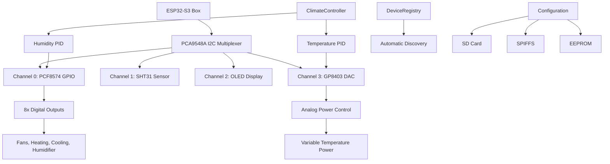
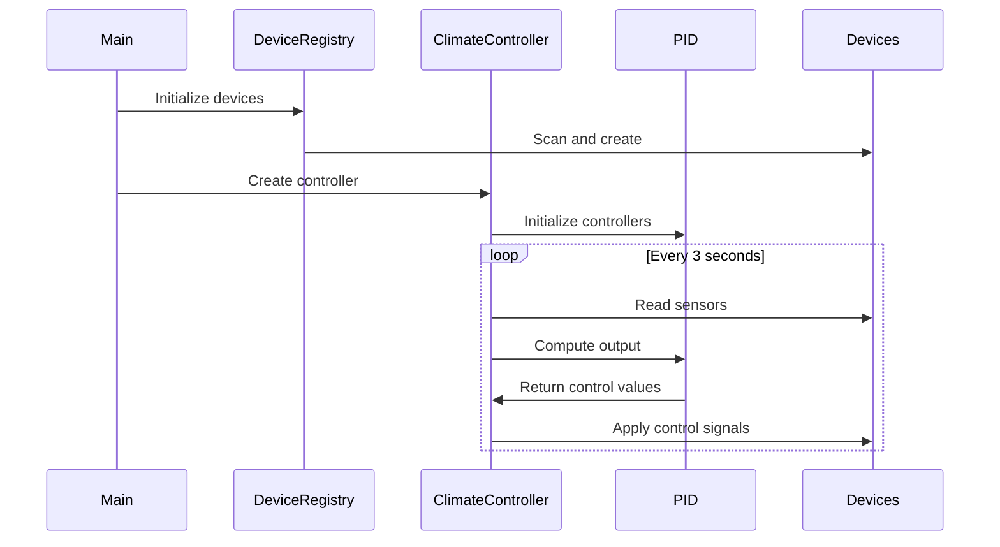

# 🌡️ Showcase Climate Controller

[](https://platformio.org/)
[](https://docs.espressif.com/projects/esp-idf/en/latest/esp32s3/)
[](https://www.arduino.cc/)
[](https://opensource.org/licenses/MIT)

> An advanced, object-oriented climate control system for ESP32-S3 featuring PID controllers, analog power management, and comprehensive device management through I2C multiplexing.

## 📋 Table of Contents

- [🌟 Features](#-features)
- [🏗️ Architecture Overview](#️-architecture-overview)
- [🔧 Hardware Requirements](#-hardware-requirements)
- [📦 Software Dependencies](#-software-dependencies)
- [🚀 Getting Started](#-getting-started)
- [📖 Usage Guide](#-usage-guide)
- [⚙️ Configuration](#️-configuration)
- [🏛️ System Architecture](#️-system-architecture)
- [🛡️ Safety Features](#️-safety-features)
- [📊 Performance](#-performance)
- [🧪 Testing](#-testing)
- [🤝 Contributing](#-contributing)
- [📄 License](#-license)

## 🌟 Features

### 🎯 **Core Climate Control**
- **Dual PID Controllers** for temperature and humidity with configurable parameters
- **Analog Power Management** via GP8403 DAC (0-100% power control)
- **Multi-mode Operation** (AUTO/HEATING/COOLING/HUMIDIFYING/DEHUMIDIFYING/OFF)
- **Safety Limits** with automatic emergency shutdown
- **Hysteresis Control** for stable operation

### 🔌 **Advanced Hardware Integration**
- **ESP32-S3 Box** with 16MB Flash and PSRAM support
- **I2C Multiplexing** via PCA9548A (8-channel support)
- **Multi-sensor Support** (SHT31/SHT40, BH1705, weight sensors)
- **GPIO Expansion** through PCF8574 (8 digital outputs)
- **User Interface** with rotary encoder and OLED display

### 🏗️ **Professional Architecture**
- **Factory Pattern** for device instantiation
- **Device Registry** with automatic discovery
- **Modular Configuration** (JSON-based with multiple sources)
- **EEPROM Persistence** with checksum validation
- **Error Recovery** and fallback mechanisms

### 📡 **Connectivity & Communication**
- **WiFi & MQTT** with throttling and reconnection
- **NTP Time Sync** for accurate logging
- **SD Card Support** for configuration and logging
- **Real-time Status** reporting and monitoring

## 🏗️ Architecture Overview



## 🔧 Hardware Requirements

### **Core Components**
| Component | Model | Purpose | I2C Address |
|-----------|-------|---------|-------------|
| **Microcontroller** | ESP32-S3 Box | Main controller with 16MB Flash | - |
| **I2C Multiplexer** | PCA9548A | 8-channel I2C switching | 0x70 |
| **GPIO Expander** | PCF8574 | 8 digital outputs | 0x20 |
| **Temp/Humidity** | SHT31/SHT40 | Environmental sensing | 0x44 |
| **DAC** | GP8403 | Analog power control | 0x5F |
| **Display** | SSD1306 OLED | User interface | 0x3C |
| **User Input** | Rotary Encoder | Setting adjustment | GPIO 4,5,6 |

### **I2C Device Mapping**
```
PCA9548A Multiplexer Channels:
├── Channel 0: PCF8574 GPIO Expander (0x20)
├── Channel 1: SHT31 Temperature/Humidity (0x44)
├── Channel 2: SSD1306 OLED Display (0x3C)
├── Channel 3: GP8403 DAC Controller (0x5F)
├── Channel 4: BH1705 Light Sensor (0x23)
├── Channel 5: Weight/Scale Sensor
├── Channel 6: [Available]
└── Channel 7: [Available]
```

### **GPIO Pin Configuration**
```
ESP32-S3 Pin Assignments:
├── GPIO 4: Rotary Encoder Channel A
├── GPIO 5: Rotary Encoder Channel B
├── GPIO 6: Rotary Encoder Button
├── GPIO 17: I2C SDA (System Bus)
└── GPIO 16: I2C SCL (System Bus)

PCF8574 Output Mapping:
├── Pin 0: Exterior Fan Control
├── Pin 1: Interior Fan Control
├── Pin 2: Humidification Control
├── Pin 3: Dehumidification Control
├── Pin 4: Temperature Enable
├── Pin 5: Cooling Control
├── Pin 6: Heating Control
└── Pin 7: Spare Output
```

## 📦 Software Dependencies

### **PlatformIO Configuration**
```ini
[env:esp32-s3-devkitc-1]
platform = espressif32
board = esp32s3box
framework = arduino
board_build.flash_mode = qio
board_build.psram_type = opi
board_upload.flash_size = 16MB

lib_deps = 
    adafruit/Adafruit NeoPixel@^1.12.5
    br3ttb/PID@^1.0.0
    br3ttb/PID-AutoTune@^1.0.0
    knolleary/PubSubClient@^2.8
    bblanchon/ArduinoJson@7.2.1
    arduino-libraries/NTPClient@^3.2.1
```

### **Library Structure**
```
lib/
├── Device/                    # 🏭 Base device class and registry
│   ├── Device.h              # Abstract base for all devices
│   └── DeviceRegistry/       # Factory pattern implementation
├── Sensors/                  # 🌡️ Environmental sensors
│   ├── SHTsensor/           # Temperature/humidity
│   ├── BH1705sensor/        # Light measurement
│   └── SCALESsensor/        # Weight measurement
├── GPIO/                     # 🔌 GPIO expansion
│   └── PCF8574gpio/         # I2C GPIO expander
├── DAC/                      # 📊 Analog output
│   └── GP8403dac/           # 12-bit DAC controller
├── Display/                  # 📺 User interface
│   └── Display.h            # OLED display management
└── Config/                   # ⚙️ Configuration management
    └── ClimateConfig/        # EEPROM-based settings
```

## 🚀 Getting Started

### **Prerequisites**
- [Visual Studio Code](https://code.visualstudio.com/)
- [PlatformIO IDE Extension](https://platformio.org/platformio-ide)
- [Git](https://git-scm.com/) (for version control)
- ESP32-S3 development board
- Required hardware components (see Hardware Requirements)

### **Installation**

1. **Clone the Repository**
   ```bash
   git clone https://github.com/your-username/showcase-climate-controller.git
   cd showcase-climate-controller
   ```

2. **Open in VS Code**
   ```bash
   code .
   ```

3. **Install Dependencies**
   - PlatformIO will automatically install dependencies from `platformio.ini`
   - Or manually via PlatformIO CLI:
   ```bash
   pio lib install
   ```

4. **Configure Hardware**
   - Connect I2C devices according to the hardware mapping
   - Verify I2C addresses match configuration
   - Check power supply requirements (3.3V/5V)

5. **Build and Upload**
   ```bash
   pio run --target upload
   ```

6. **Monitor Serial Output**
   ```bash
   pio device monitor --baud 115200
   ```

### **First Run Setup**

1. **Device Discovery**
   - System automatically scans I2C bus
   - Initializes all detected devices
   - Creates default configuration if none exists

2. **Configuration Files**
   ```
   SD Card (preferred):
   ├── config.json           # Main system configuration
   ├── ClimateConfig.json    # Climate-specific settings
   └── devices.json          # Device definitions
   
   SPIFFS (fallback):
   └── data/
       ├── config.json
       └── ClimateConfig.json
   ```

3. **Initial Calibration**
   - Set temperature and humidity setpoints
   - Adjust PID parameters if needed
   - Test safety limits and emergency shutdown

## 📖 Usage Guide

### **Basic Operation**

1. **System Startup**
   ```
   [INFO] Starting Showcase Climate Controller...
   [INFO] Scanning I2C bus...
   [INFO] Found 5 devices
   [INFO] Initializing Climate Controller...
   [INFO] PID controllers ready
   [INFO] System operational
   ```

2. **Setting Adjustment**
   - **Rotate encoder**: Change temperature/humidity setpoints
   - **Press button**: Save settings to EEPROM
   - **Hold button**: Enter configuration mode

3. **Mode Selection**
   - **AUTO**: Automatic heating/cooling based on setpoint
   - **HEATING**: Heating only mode
   - **COOLING**: Cooling only mode
   - **OFF**: Climate control disabled

### **Advanced Features**

#### **PID Tuning**
```cpp
// Access via serial commands or configuration file
climateController->setTemperaturePID(2.0, 0.5, 0.1);  // Kp, Ki, Kd
climateController->setHumidityPID(1.0, 0.2, 0.05);
```

#### **Safety Limits**
```json
{
  "safety_limits": {
    "max_temperature": 35.0,
    "min_temperature": 10.0,
    "max_humidity": 80.0,
    "min_humidity": 20.0
  }
}
```

#### **Power Control**
```cpp
// DAC provides 0-5V output for variable power
// 0V = 0% power, 5V = 100% power
setHeatingPower(75.0);  // 75% heating power = 3.75V output
```

## ⚙️ Configuration

### **Configuration Hierarchy**
1. **SD Card** (`/config.json`) - Highest priority
2. **SPIFFS** (`/data/config.json`) - Fallback
3. **EEPROM** (ClimateConfig) - Persistent settings
4. **Compiled Defaults** - Last resort

### **Main Configuration (`config.json`)**
```json
{
  "system": {
    "device_name": "ClimateController_01",
    "update_interval_ms": 5000,
    "debug_level": 3
  },
  "wifi": {
    "ssid": "YourNetwork",
    "password": "YourPassword",
    "timeout_ms": 10000
  },
  "mqtt": {
    "server": "mqtt.broker.com",
    "port": 1883,
    "topic_prefix": "climate/controller"
  },
  "climate": {
    "enabled": true,
    "temperature_setpoint": 22.0,
    "humidity_setpoint": 50.0,
    "update_interval_ms": 3000
  }
}
```

### **Climate Configuration (`ClimateConfig.json`)**
```json
{
  "setpoints": {
    "temperature": 22.0,
    "humidity": 50.0
  },
  "modes": {
    "climate_mode": "AUTO",
    "humidity_mode": "AUTO"
  },
  "pid_parameters": {
    "temperature": {
      "kp": 2.0,
      "ki": 0.5,
      "kd": 0.1
    },
    "humidity": {
      "kp": 1.0,
      "ki": 0.2,
      "kd": 0.05
    }
  },
  "safety_limits": {
    "max_temperature": 35.0,
    "min_temperature": 10.0,
    "max_humidity": 80.0,
    "min_humidity": 20.0
  }
}
```

## 🏛️ System Architecture

### **Design Patterns**

#### **Factory Pattern (DeviceRegistry)**
```cpp
class DeviceRegistry {
public:
    static DeviceRegistry& getInstance();
    Device* createDevice(const String& type, const JsonObject& config);
    Device* getDeviceByType(const String& type, int index = 0);
    Device* getDeviceByTypeAndLabel(const String& type, const String& label);
};
```

#### **Singleton Pattern (Configuration)**
```cpp
class Configuration {
private:
    static Configuration* instance;
    Configuration() = default;
public:
    static Configuration& getInstance();
    bool loadFromSD(const String& filename);
    bool loadFromSPIFFS(const String& filename);
};
```

#### **Observer Pattern (Device Updates)**
```cpp
class Device {
public:
    virtual void update() = 0;
    virtual std::map<String, String> readData() = 0;
    virtual bool isConnected() = 0;
};
```

### **Control Flow**



### **Error Handling Strategy**

1. **Graceful Degradation**
   - Continue operation with reduced functionality
   - Log errors for debugging
   - Attempt recovery on next cycle

2. **Safety-First Approach**
   - Immediate shutdown on critical errors
   - Return to safe state (all outputs OFF)
   - Require manual intervention to restart

3. **Retry Mechanisms**
   - I2C communication retries (3 attempts)
   - Device reinitialization on persistent failures
   - Configuration reload on corruption

## 🛡️ Safety Features

### **Hardware Safety**
- **Sensor Validation**: Continuous monitoring of sensor readings
- **Limit Checking**: Configurable min/max thresholds
- **Emergency Shutdown**: Immediate cutoff on safety violations
- **Watchdog Protection**: System reset on software hangs

### **Software Safety**
- **Input Validation**: All user inputs validated and sanitized
- **Memory Management**: Careful allocation and deallocation
- **Exception Handling**: Try-catch blocks for critical operations
- **Checksum Validation**: EEPROM data integrity verification

### **Operational Safety**
```cpp
bool ClimateController::checkSafetyLimits() {
    if (currentTemperature > maxTemperature || 
        currentTemperature < minTemperature ||
        currentHumidity > maxHumidity || 
        currentHumidity < minHumidity) {
        emergencyShutdown();
        return false;
    }
    return true;
}
```

## 📊 Performance

### **System Specifications**
- **Update Rate**: 3-second climate control cycle
- **Response Time**: <1 second for control changes
- **Accuracy**: ±0.1°C temperature, ±2% humidity
- **Memory Usage**: ~180KB Flash, ~45KB RAM
- **Power Consumption**: ~150mA @ 3.3V (excluding actuators)

### **Benchmarks**
```
Device Initialization: 2.3 seconds
I2C Scan (8 channels): 850ms
PID Computation: <1ms
Configuration Load: 45ms
EEPROM Write: 12ms
Display Update: 8ms
```

### **Scalability**
- **Maximum Devices**: 64 (8 channels × 8 devices per channel)
- **Configuration Size**: Up to 64KB JSON files
- **Sensor History**: 1000 data points in RAM
- **Log File Size**: Limited by SD card capacity

## 🧪 Testing

### **Unit Testing**
```bash
# Run device-specific tests
pio test -e native -f test_devices

# Run climate controller tests
pio test -e native -f test_climate_controller

# Run configuration tests
pio test -e native -f test_configuration
```

### **Integration Testing**
```bash
# Hardware-in-loop testing
pio test -e esp32-s3-devkitc-1 -f test_integration

# I2C communication tests
pio test -e esp32-s3-devkitc-1 -f test_i2c_devices
```

### **Manual Testing Checklist**
- [ ] Device discovery and initialization
- [ ] Temperature control accuracy
- [ ] Humidity control accuracy
- [ ] Safety limit enforcement
- [ ] Emergency shutdown functionality
- [ ] Configuration persistence
- [ ] User interface responsiveness
- [ ] MQTT communication
- [ ] Power management

## 🤝 Contributing

### **Development Setup**
1. Fork the repository
2. Create a feature branch (`git checkout -b feature/amazing-feature`)
3. Follow the coding standards (see `CODING_STANDARDS.md`)
4. Add tests for new functionality
5. Commit changes (`git commit -m 'Add amazing feature'`)
6. Push to branch (`git push origin feature/amazing-feature`)
7. Create a Pull Request

### **Coding Standards**
- **C++ Style**: Follow Google C++ Style Guide
- **Naming**: PascalCase for classes, camelCase for functions
- **Documentation**: Doxygen-style comments for all public APIs
- **Testing**: Unit tests required for all new features

### **Bug Reports**
Please include:
- Hardware configuration
- Software version
- Steps to reproduce
- Expected vs actual behavior
- Serial output logs

## 📄 License

This project is licensed under the MIT License - see the [LICENSE](LICENSE) file for details.

### **Third-Party Licenses**
- PID Library: MIT License
- ArduinoJson: MIT License
- Adafruit Libraries: BSD License
- ESP32 Arduino Core: LGPL 2.1

## 🙏 Acknowledgments

- **Fontys University of Applied Sciences** - Educational support
- **Espressif Systems** - ESP32-S3 platform
- **PlatformIO** - Development environment
- **Arduino Community** - Libraries and support
- **Contributors** - All project contributors

## 📞 Support

- **Documentation**: [Project Wiki](https://github.com/your-username/showcase-climate-controller/wiki)
- **Issues**: [GitHub Issues](https://github.com/your-username/showcase-climate-controller/issues)
- **Discussions**: [GitHub Discussions](https://github.com/your-username/showcase-climate-controller/discussions)
- **Contact**: ron.groenen@student.fontys.nl

---

**Made with ❤️ by [Ron Groenen](https://github.com/your-username) at Fontys University of Applied Sciences**

*This project showcases advanced embedded systems programming techniques and serves as an educational platform for IoT climate control systems.*
